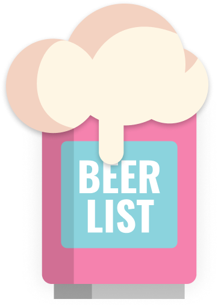

<p align="center">
    <a href="https://github.com/gigu-io/beerlist">
        
    </a>
</p>

<p align="center">
  <strong>
    A <br />
    <a href="https://beer.gigu.io/">Beer List</a>
    <br />
    for handling beer betting debts 
  </strong>
</p>

<p align="center">
  <a href="https://github.com/gigu-io/beerlist/issues"></a>
  <a href="https://github.com/sponsors/janlauber"></a>
  <a href="https://github.com/gigu-io/beerlist"></a>
  <a href="https://www.codefactor.io/repository/github/gigu-io/beerlist"></a>
</p>

<p align="center">
    <strong>This is the official IOs and Android App Repository</strong><br/>
    Visit <a href="https://github.com/gigu-io/beerlist" target="_blank">https://github.com/gigu-io/beerlist</a> for more information.
</p>

## Dev Docs

```bash
flutter pub add firebase_core
flutterfire configure
```